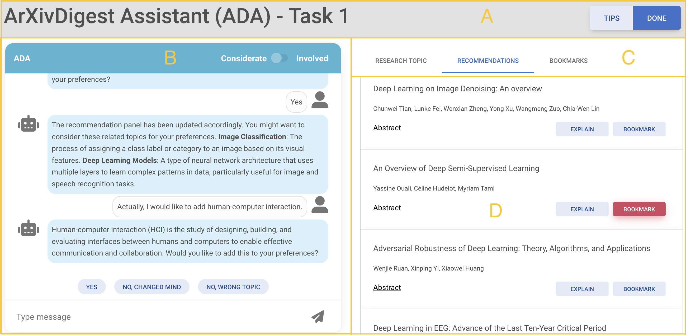

# Should We Tailor the Talk? Understanding the Impact of Conversational Styles on Preference Elicitation in Conversational Recommender Systems

This repository provides resources developed within the following article [[PDF](https://arxiv.org/abs/2504.13095)] (To be published in UMAP 2025):

> I. Kostric, K. Balog, U. Gadiraju. **Should We Tailor the Talk? Understanding the Impact of Conversational Styles on Preference Elicitation in Conversational Recommender Systems** In: Proceedings of the 33rd ACM Conference on User Modeling, Adaptation and Personalization (UMAP ’25), June 2025. [DOI: 10.1145/3699682.3728353](https://doi.org/10.1145/3699682.3728353)

## Summary

Conversational recommender systems (CRSs) let users express preferences interactively and receive real‑time personalized recommendations. Their success depends heavily on preference elicitation. While prior work has focused on what to ask, little is known about how broader interaction patterns—tone, pacing, and proactiveness affect task success.

We ran a controlled experiment in scientific‑paper recommendation, contrasting two conversational styles:

  * High involvement - fast paced, direct and highly proactive
  * High considerateness - polite and accommodating, prioritizing clarity and user comfort

Participants also experienced a flexible condition in which they could switch between styles. Results show that adapting style to user expertise, and letting users switch, improves both satisfaction and recommendation quality.

## Conversational‑style criteria

| **Criteria**               | **High Involvement**  | **High Considerateness** |
|----------------------------|-----------------------|--------------------------|
| C1. Rate of speech         | fast                  | slow                     |
| C2. Turn-taking            | fast                  | slow                     |
| C3. Introduction of topics | w/o hesitation        | w/ hesitation            |
| C4. Use of syntax          | simple                | complex                  |
| C5. Directness of content  | direct                | indirect                 |
| C6. Utterance of questions | frequent              | rare                     |

## Study UI

The figure below shows the UI seen by participants.

  * A: Main study navigation.
  * B: Chat interface. The header contains the style switch. In the first two tasks the switch is disabled; in the final task participants may toggle styles.
  * C: Tabs controlling the task context
    - Research topic — title and description of the topic
    - Recommendations — current paper recommendations
    - Bookmarks — bookmarked papers for the active task
  * D: Content area that reflects the selected tab.




## Installation

1. **Clone the repository:**

   ```sh
   git clone https://github.com/iai-group/umap2025-convstyles
   cd umap2025-convstyles
   ```

2. **Run the server and client:**

Follow the instructions in the [client README](code/client/README.md) and [server README](code/server/README.md) or run the quick start below.


```sh
# start the server
cd code/server
python -m ada.main  # default: http://localhost:5000

# in a new terminal, start the client
cd ../client
npm install
npm start                       # default: http://localhost:3000
```

Open <http://localhost:3000> in your browser to use the application.

## Citation

If you use the resources presented in this repository, please cite:

```sh
@misc{kostric:2025:arxiv,
      title={Should We Tailor the Talk? Understanding the Impact of Conversational Styles on Preference Elicitation in Conversational Recommender Systems}, 
      author={Ivica Kostric and Krisztian Balog and Ujwal Gadiraju},
      year={2025},
      eprint={2504.13095},
      archivePrefix={arXiv},
      primaryClass={cs.HC},
      url={https://arxiv.org/abs/2504.13095}, 
}
```


## Contact

Should you have any questions, please contact Ivica Kostric at [ivica.kostric@uis.no](mailto:ivica.kostric@uis.no).
